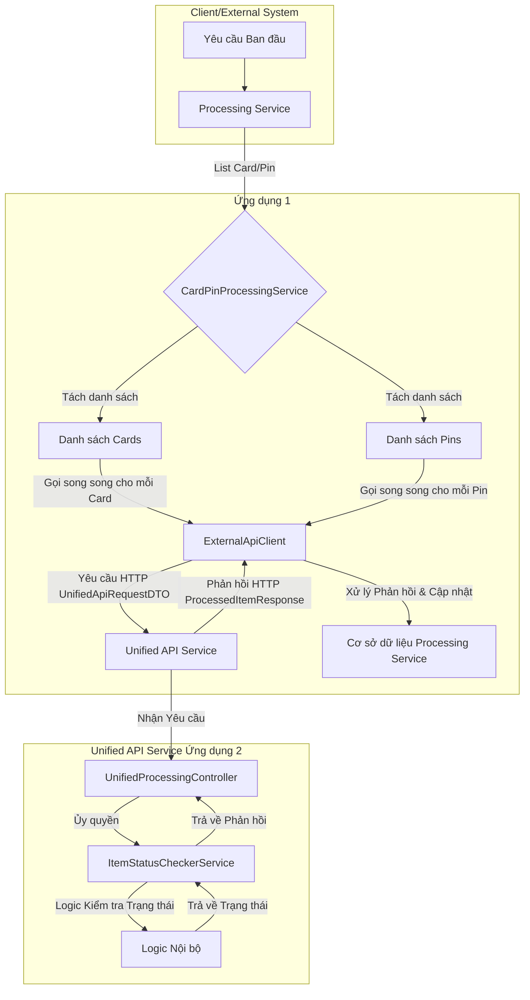

# Luồng Xử lý Thẻ và PIN

## 1. Tổng quan Hệ thống

Hệ thống được thiết kế để xử lý đồng thời danh sách các đối tượng `Card` và `Pin` thông qua một dịch vụ API hợp nhất (`Unified API Service`). Quá trình này được thực hiện bởi hai dịch vụ chính:

*   **`Processing Service`**: Dịch vụ này nhận đầu vào là một danh sách hỗn hợp các đối tượng `Card` và `Pin`, sau đó tách chúng ra và xử lý song song bằng cách gọi đến `Unified API Service`. Nó cũng chịu trách nhiệm cập nhật trạng thái của các đối tượng `Card` và `Pin` vào cơ sở dữ liệu của riêng mình.
*   **`Unified API Service`**: Dịch vụ này cung cấp một API duy nhất để `Processing Service` gọi đến, kiểm tra trạng thái của `Card` hoặc `Pin` và phản hồi lại thông tin cần thiết.

## 2. Kiến trúc Tổng quan



## 3. Luồng Xử lý Chi tiết

### 3.1. `Processing Service`

1.  **Nhận Yêu cầu:** `CardPinProcessingService` nhận một `List<Object>` chứa hỗn hợp các đối tượng `Card` và `Pin`, cùng với một `requestId` để theo dõi.
2.  **Tách Danh sách:**
    *   Danh sách `mixedItems` được phân loại thành `List<Card>` và `List<Pin>`.
    *   Mỗi đối tượng `Card` và `Pin` được gán `requestId` tương ứng.
3.  **Xử lý Song song (Reactive Streams với `Flux` và `Mono`):**
    *   `CardPinProcessingService` sử dụng `Flux.fromIterable` để tạo ra các luồng dữ liệu từ danh sách `Card` và `Pin` đã tách.
    *   `flatMap` được sử dụng để chuyển đổi mỗi `Card` hoặc `Pin` thành một `Mono<ProcessedItemResponse>` từ cuộc gọi API đến `Unified API Service`. Điều này cho phép các cuộc gọi API được thực hiện một cách bất đồng bộ và song song.
    *   `Flux.merge` được sử dụng để kết hợp các luồng xử lý cho `Card` và `Pin` thành một luồng duy nhất, cho phép xử lý đồng thời.
    *   **Xử lý Lỗi Reactive:** Các operator như `onErrorResume` được sử dụng để bắt và xử lý lỗi trong luồng reactive. Nếu có lỗi trong quá trình xử lý một `Card` hoặc `Pin`, trạng thái của đối tượng sẽ được cập nhật thành `FAILED_PROCESSING` trong cơ sở dữ liệu và luồng sẽ tiếp tục mà không bị gián đoạn.
4.  **Gọi API Ngoại vi (`ExternalApiClient`):**
    *   Đối tượng `Card` hoặc `Pin` được chuyển đổi thành `UnifiedApiRequestDTO` (chứa `ItemType` và dữ liệu tương ứng).
    *   `ExternalApiClient` sử dụng `WebClient` để gửi `UnifiedApiRequestDTO` đến `Unified API Service` qua endpoint `/check-status`.
    *   **Cấu hình `WebClient`:** `WebClient` được cấu hình với `HttpClient` tùy chỉnh, sử dụng `ConnectionProvider` có kích thước nhóm kết nối lớn (`unified.api.connection-pool-size`) và thời gian chờ kết nối/đọc (`connect-timeout-millis`, `read-timeout-millis`) được tăng cường để đảm bảo độ bền khi gọi API.
    *   **Cơ chế Bất đồng bộ và Non-blocking**: `WebClient` hoàn toàn non-blocking, sử dụng Project Reactor để quản lý các cuộc gọi HTTP. Khi `ExternalApiClient` gọi API, nó sẽ trả về một `Mono` đại diện cho kết quả. Luồng hiện tại sẽ không bị chặn. Các callback (`doOnNext`, `doOnError`) được đăng ký để xử lý phản hồi khi nó đến.
    *   **Loại bỏ `Semaphore`**: Cơ chế giới hạn cuộc gọi đồng thời bằng `Semaphore` đã được loại bỏ để duy trì tính non-blocking hoàn toàn của luồng Reactive. Việc quản lý áp lực ngược và đồng thời được thực hiện thông qua các cơ chế của Project Reactor và cấu hình `WebClient`.
5.  **Xử lý Phản hồi API (`handleProcessingResponse`):**
    *   Sau khi nhận được `ProcessedItemResponse` từ `Unified API Service`, phương thức `handleProcessingResponse` sẽ được gọi.
    *   Phương thức này sử dụng các phương thức reactive của `ReactiveCrudRepository` (`findById`, `save`) để tìm kiếm và cập nhật `Card` hoặc `Pin` tương ứng trong cơ sở dữ liệu của chính nó. Các thao tác này giờ đây cũng là non-blocking.
    *   `flatMap` được sử dụng để đảm bảo chuỗi các thao tác tìm kiếm và lưu trữ là bất đồng bộ và không chặn.
6.  **Tổng hợp Kết quả:** `Flux.merge` kết hợp các luồng xử lý riêng lẻ. `doFinally` được sử dụng để thực hiện hành động sau khi tất cả các phần tử trong luồng đã được xử lý (ví dụ: ghi log tổng kết).

### 3.2. `Unified API Service`

1.  **Nhận Yêu cầu:** `UnifiedProcessingController` nhận yêu cầu `POST` chứa `UnifiedApiRequestDTO` từ `Processing Service` tại endpoint (ví dụ: `/api/check-status`).
2.  **Ủy quyền Xử lý:** Controller ủy quyền xử lý DTO này cho `ItemStatusCheckerService`.
3.  **Logic Kiểm tra Trạng thái:** `ItemStatusCheckerService` chứa logic để kiểm tra trạng thái của `Card` hoặc `Pin` dựa trên `ItemType` và dữ liệu được cung cấp trong `UnifiedApiRequestDTO`. Logic này có thể bao gồm việc tra lookup trong cơ sở dữ liệu nội bộ hoặc thực hiện các kiểm tra nghiệp vụ khác.
    *   **Dedicated Executor for CPU-bound tasks**: `ItemStatusCheckerService` now uses a dedicated `ExecutorService` (configured via `app.status-checker.thread-pool.size` in `application.properties`) for its `CompletableFuture.supplyAsync()` calls. This ensures that CPU-intensive status checking logic runs on an appropriately sized thread pool, preventing overload of the shared `ForkJoinPool.commonPool()` and providing better isolation and control over CPU utilization.
4.  **Trả về Phản hồi:** Sau khi kiểm tra, `ItemStatusCheckerService` trả về một `ProcessedItemResponse` chứa ID của đối tượng, `ItemType`, và trạng thái xử lý (`status`) cho `Processing Service`.

## 4. Cấu trúc Thư mục Chính (Ví dụ)

```
.
├── processing-service
│   ├── src/main/java/com/example/processingservice
│   │   ├── dto                 (Các DTO dùng để giao tiếp API)
│   │   │   ├── ProcessedItemResponse.java
│   │   │   └── UnifiedApiRequestDTO.java
│   │   ├── model               (Các Entity của cơ sở dữ liệu cục bộ)
│   │   │   ├── Card.java
│   │   │   └── Pin.java
│   │   ├── repository          (Các Spring Data R2DBC Reactive Repository)
│   │   │   ├── CardRepository.java
│   │   │   └── PinRepository.java
│   │   ├── service             (Các Service logic nghiệp vụ)
│   │   │   ├── CardPinProcessingService.java
│   │   │   └── ExternalApiClient.java
│   │   └── ProcessingServiceApplication.java
│   └── src/main/resources
│       └── application.properties (Cấu hình ứng dụng, bao gồm WebClient và logging)
└── unified-api-service
    ├── src/main/java/com/example/unifiedapiservice
    │   ├── controller          (Các REST Controller)
    │   │   └── UnifiedProcessingController.java
    │   │   ├── dto                 (Các DTO nhận/gửi từ Processing Service)
    │   │   │   ├── ProcessedItemResponse.java
    │   │   │   └── UnifiedApiRequestDTO.java
    │   │   ├── service             (Logic kiểm tra trạng thái)
    │   │   │   └── ItemStatusCheckerService.java
    │   │   └── config            (Cấu hình các Bean, ví dụ ExecutorService)
    │   │       └── ExecutorConfig.java
    │   └── src/main/resources
    │       └── application.properties
```

## 5. Các Vấn đề Phi Chức Năng Quan trọng

*   **Deadlock và Thread Starvation:** Giảm thiểu bằng cách áp dụng các nguyên tắc lập trình reactive (non-blocking I/O, sử dụng `Mono`/`Flux` và `Schedulers` một cách hợp lý) để tránh các luồng bị chặn. Điều này giúp hệ thống phản hồi nhanh hơn và hiệu quả hơn.
*   **Memory Leak:** Quản lý tài nguyên hiệu quả trong các luồng reactive. Đảm bảo các `Disposable` được xử lý đúng cách và tránh các tham chiếu giữ lại đối tượng không cần thiết trong các operator reactive.
*   **Logging và Giám sát:** Triển khai logging chi tiết với `requestId` (hoặc `correlationId`) để theo dõi luồng xử lý qua các dịch vụ và luồng khác nhau. Sử dụng các công cụ giám sát để theo dõi hiệu suất của các luồng reactive.
*   **API Resilience:** Mở rộng với các cơ chế như Retry và Circuit Breaker (tương thích reactive, ví dụ: Resilience4j) để tăng cường độ bền của cuộc gọi API trong môi trường bất đồng bộ.