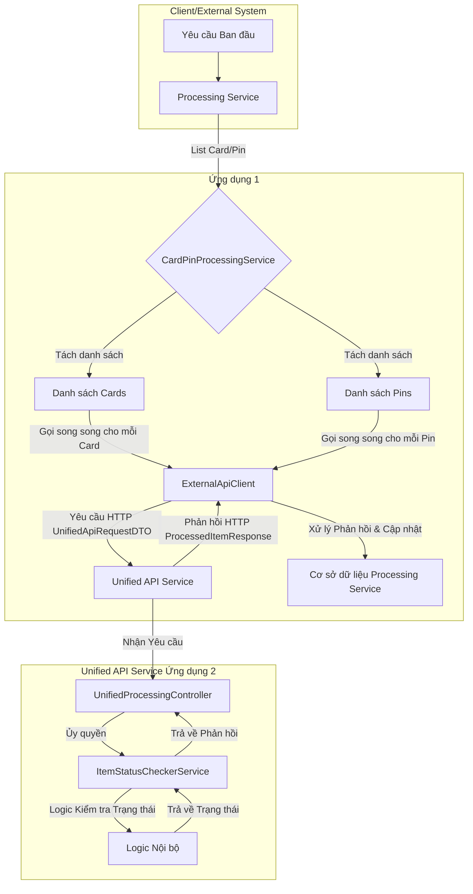

# Luồng Xử lý Thẻ và PIN

## 1. Tổng quan Hệ thống

Hệ thống được thiết kế để xử lý đồng thời danh sách các đối tượng `Card` và `Pin` thông qua một dịch vụ API hợp nhất (`Unified API Service`). Quá trình này được thực hiện bởi hai dịch vụ chính:

*   **`Processing Service`**: Dịch vụ này nhận đầu vào là một danh sách hỗn hợp các đối tượng `Card` và `Pin`, sau đó tách chúng ra và xử lý song song bằng cách gọi đến `Unified API Service`. Nó cũng chịu trách nhiệm cập nhật trạng thái của các đối tượng `Card` và `Pin` vào cơ sở dữ liệu của riêng mình.
*   **`Unified API Service`**: Dịch vụ này cung cấp một API duy nhất để `Processing Service` gọi đến, kiểm tra trạng thái của `Card` hoặc `Pin` và phản hồi lại thông tin cần thiết.

## 2. Kiến trúc Tổng quan



## 3. Luồng Xử lý Chi tiết

### 3.1. `Processing Service`

1.  **Nhận Yêu cầu:** `CardPinProcessingService` nhận một `List<Object>` chứa hỗn hợp các đối tượng `Card` và `Pin`, cùng với một `requestId` để theo dõi.
2.  **Tách Danh sách:**
    *   Danh sách `mixedItems` được phân loại thành `List<Card>` và `List<Pin>`.
    *   Mỗi đối tượng `Card` và `Pin` được gán `requestId` tương ứng.
3.  **Xử lý Song song (`CompletableFuture` và `ThreadPoolExecutor`):**
    *   Đối với mỗi `Card` và `Pin` trong danh sách đã tách, một tác vụ xử lý riêng biệt được tạo và gửi đến một `ThreadPoolExecutor` tùy chỉnh.
    *   Mỗi tác vụ này được gói gọn trong một `CompletableFuture` để thực hiện bất đồng bộ.
    *   **Cấu hình `ThreadPoolExecutor`:** Nhóm luồng này được cấu hình với kích thước cốt lõi, kích thước tối đa, và quan trọng nhất là một hàng đợi có giới hạn (`LinkedBlockingQueue`) cùng với chính sách từ chối `ThreadPoolExecutor.CallerRunsPolicy`.
        *   **`CallerRunsPolicy`**: Khi hàng đợi tác vụ của nhóm luồng đầy, tác vụ mới sẽ không bị từ chối mà thay vào đó, luồng đã gửi tác vụ đó sẽ tự thực thi tác vụ. Điều này tạo ra áp lực ngược, làm chậm tốc độ gửi tác vụ và giúp hệ thống tự điều chỉnh, ngăn chặn tình trạng quá tải.
    *   **Xử lý Lỗi Song song:** Mỗi `CompletableFuture` có một khối `exceptionally` để bắt và xử lý lỗi riêng lẻ cho từng `Card` hoặc `Pin`. Nếu có lỗi, trạng thái của đối tượng sẽ được cập nhật thành `FAILED_PROCESSING` trong cơ sở dữ liệu cục bộ.
4.  **Gọi API Ngoại vi (`ExternalApiClient`):**
    *   Trong mỗi tác vụ song song, đối tượng `Card` hoặc `Pin` được chuyển đổi thành `UnifiedApiRequestDTO` (chứa `ItemType` và dữ liệu tương ứng).
    *   `ExternalApiClient` sử dụng `WebClient` để gửi `UnifiedApiRequestDTO` đến `Unified API Service` qua endpoint `/check-status`.
    *   **Cấu hình `WebClient`:** `WebClient` được cấu hình với `HttpClient` tùy chỉnh, sử dụng `ConnectionProvider` có kích thước nhóm kết nối lớn (`unified.api.connection-pool-size`) và thời gian chờ kết nối/đọc (`connect-timeout-millis`, `read-timeout-millis`) được tăng cường để đảm bảo độ bền khi gọi API.
    *   Phản hồi từ `Unified API Service` là một `Mono<ProcessedItemResponse>`.
    *   **Cơ chế Bất đồng bộ và Non-blocking**: Khi `ExternalApiClient` gọi API, nó sẽ trả về ngay lập tức một đối tượng `Mono` đại diện cho kết quả sẽ có trong tương lai. Tại thời điểm này, luồng hiện tại sẽ **không bị chặn** để chờ phản hồi. Thay vào đó, nó sẽ đăng ký các hàm callback (`doOnNext` để xử lý thành công, `doOnError` để xử lý lỗi) và được giải phóng để thực hiện các tác vụ khác (ví dụ: gửi các yêu cầu API khác cho các thẻ/PIN khác). `WebClient` sử dụng một nhóm luồng I/O riêng biệt để quản lý cuộc gọi HTTP một cách bất đồng bộ. Khi phản hồi từ API trở về, các callback đã đăng ký sẽ được kích hoạt để xử lý dữ liệu và cập nhật cơ sở dữ liệu.
5.  **Xử lý Phản hồi API (`handleProcessingResponse`):**
    *   Sau khi nhận được `ProcessedItemResponse` từ `Unified API Service`, phương thức `handleProcessingResponse` sẽ được gọi.
    *   Dựa trên `ItemType` (CARD/PIN) và `id` trong phản hồi, dịch vụ sẽ tìm kiếm `Card` hoặc `Pin` tương ứng trong cơ sở dữ liệu của chính nó.
    *   Trạng thái (`status`) của `Card` hoặc `Pin` trong cơ sở dữ liệu cục bộ sẽ được cập nhật dựa trên phản hồi từ API.
6.  **Tổng hợp Kết quả:** `CompletableFuture.allOf()` được sử dụng để chờ tất cả các tác vụ song song (`cardFutures` và `pinFutures`) hoàn thành trước khi thông báo rằng toàn bộ quá trình xử lý đã kết thúc.

### 3.2. `Unified API Service`

1.  **Nhận Yêu cầu:** `UnifiedProcessingController` nhận yêu cầu `POST` chứa `UnifiedApiRequestDTO` từ `Processing Service` tại endpoint (ví dụ: `/api/check-status`).
2.  **Ủy quyền Xử lý:** Controller ủy quyền xử lý DTO này cho `ItemStatusCheckerService`.
3.  **Logic Kiểm tra Trạng thái:** `ItemStatusCheckerService` chứa logic để kiểm tra trạng thái của `Card` hoặc `Pin` dựa trên `ItemType` và dữ liệu được cung cấp trong `UnifiedApiRequestDTO`. Logic này có thể bao gồm việc tra cứu trong cơ sở dữ liệu nội bộ hoặc thực hiện các kiểm tra nghiệp vụ khác.
4.  **Trả về Phản hồi:** Sau khi kiểm tra, `ItemStatusCheckerService` trả về một `ProcessedItemResponse` chứa ID của đối tượng, `ItemType`, và trạng thái xử lý (`status`) cho `Processing Service`.

## 4. Cấu trúc Thư mục Chính (Ví dụ)

```
.
├── processing-service
│   ├── src/main/java/com/example/processingservice
│   │   ├── dto                 (Các DTO dùng để giao tiếp API)
│   │   │   ├── ProcessedItemResponse.java
│   │   │   └── UnifiedApiRequestDTO.java
│   │   ├── model               (Các Entity của cơ sở dữ liệu cục bộ)
│   │   │   ├── Card.java
│   │   │   └── Pin.java
│   │   ├── repository          (Các Spring Data JPA Repository)
│   │   │   ├── CardRepository.java
│   │   │   └── PinRepository.java
│   │   ├── service             (Các Service logic nghiệp vụ)
│   │   │   ├── CardPinProcessingService.java
│   │   │   └── ExternalApiClient.java
│   │   └── ProcessingServiceApplication.java
│   └── src/main/resources
│       └── application.properties (Cấu hình ứng dụng, bao gồm WebClient và ThreadPool)
└── unified-api-service
    ├── src/main/java/com/example/unifiedapiservice
    │   ├── controller          (Các REST Controller)
    │   │   └── UnifiedProcessingController.java
    │   ├── dto                 (Các DTO nhận/gửi từ Processing Service)
    │   │   ├── ProcessedItemResponse.java
    │   │   └── UnifiedApiRequestDTO.java
    │   └── service             (Logic kiểm tra trạng thái)
    │       └── ItemStatusCheckerService.java
    └── src/main/resources
        └── application.properties
```

## 5. Các Vấn đề Phi Chức Năng Quan trọng

*   **Deadlock và Thread Starvation:** Giảm thiểu bằng cách sử dụng `CompletableFuture` và cấu hình `ThreadPoolExecutor` một cách cẩn thận, tránh các tác vụ chặn trong nhóm luồng. `CallerRunsPolicy` cũng giúp điều hòa tải.
*   **Memory Leak:** Quản lý tài nguyên `ExecutorService` đúng cách (shutdown khi không cần thiết) và sử dụng `try-with-resources` để đóng tài nguyên.
*   **Logging và Giám sát:** Triển khai logging chi tiết với `requestId` để theo dõi luồng xử lý qua các dịch vụ và luồng khác nhau.
*   **API Resilience:** Có thể mở rộng với các cơ chế như Retry và Circuit Breaker để tăng cường độ bền của cuộc gọi API.